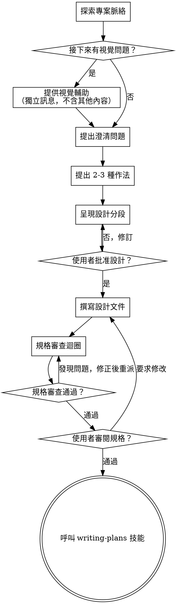

# 以腦力激盪將想法轉為設計

透過自然的協作對話，把想法轉成完整的設計與規格。

先理解目前的專案脈絡，再一次只問一個問題來精煉想法。當你理解要做什麼後，提出設計並取得使用者批准。

<HARD-GATE>
在你提出設計且使用者批准之前，**不得**呼叫任何實作技能、撰寫任何程式碼、建立任何專案骨架或進行任何實作行動。無論專案看起來多簡單，**每個專案都適用**。
</HARD-GATE>

## 反模式：「這太簡單，不需要設計」

每個專案都要走這個流程。待辦清單、單一函式工具、設定變更 — 全都一樣。「簡單」專案最容易因未檢視的假設而造成最多浪費。設計可以很短（真正簡單的專案可用幾句話），但你**必須**提出設計並取得批准。

## 檢查清單

你**必須**為以下每一項建立任務，並依序完成：

1. **探索專案脈絡** — 檢查檔案、文件、近期提交
2. **提供視覺輔助**（若議題涉及視覺問題）— 這要單獨成一則訊息，不要與澄清問題混在一起。見下方「視覺輔助」章節。
3. **提出澄清問題** — 一次一個，理解目的/限制/成功標準
4. **提出 2-3 種作法** — 附上取捨與你的建議
5. **呈現設計** — 依複雜度分段呈現，每段後取得使用者批准
6. **撰寫設計文件** — 存到 `docs/superpowers/specs/YYYY-MM-DD-<topic>-design.md` 並提交
7. **規格審查迴圈** — 派出 spec-document-reviewer 子代理，提供精準審查脈絡（絕不提供你的會話紀錄）；修正問題並重派直到通過（最多 5 次，超過就回報使用者）
8. **使用者審閱已寫規格** — 請使用者在繼續前審閱規格檔
9. **轉換到實作** — 呼叫 writing-plans 技能建立實作計畫

## 流程圖

**終點狀態是呼叫 writing-plans。**不要呼叫 frontend-design、mcp-builder 或其他實作技能。腦力激盪之後**唯一**可呼叫的技能是 writing-plans。

## 流程說明

**理解想法：**

- 先查看目前專案狀態（檔案、文件、近期提交）
- 在問細節前，先評估範圍：若需求描述多個獨立子系統（例如「打造一個平台，包含聊天、檔案儲存、計費與分析」），要立即指出並先拆解，不要直接進入細節
- 若專案大到無法單一規格涵蓋，協助使用者拆成子專案：哪些是獨立的部分、彼此關係、應該先做哪一個。然後只針對第一個子專案走完整設計流程。每個子專案都有自己的規格 → 計畫 → 實作循環。
- 對範圍適當的專案，一次問一個問題來精煉想法
- 盡量使用多選題，但開放式也可
- 每則訊息只問一個問題 — 若某主題需要更深入探索，拆成多則問題
- 著重理解：目的、限制、成功標準

**探索作法：**

- 提出 2-3 種不同作法並說明取捨
- 以對話方式呈現選項，並說明你的建議與理由
- 先講推薦方案，並解釋原因

**呈現設計：**

- 當你認為已理解要做什麼，就提出設計
- 每段依複雜度調整長度：簡單的幾句話即可，複雜的可到 200-300 字
- 每一段後詢問使用者是否看起來正確
- 涵蓋：架構、元件、資料流、錯誤處理、測試
- 若有地方不清楚，要準備回頭釐清

**為隔離性與清晰度而設計：**

- 將系統拆成小單元，每個單元只有一個明確目的，透過清楚介面溝通，且可獨立理解與測試
- 對每個單元，你應能回答：它做什麼、如何使用、依賴什麼？
- 能否不看內部就理解單元功能？能否在不影響使用者的情況下修改內部？若不能，邊界需調整。
- 小而清楚的單元也更容易讓你工作 — 你能更容易推理可一次掌握的程式碼，檔案越聚焦修改越可靠。檔案變大通常表示它做太多事。

**在既有程式碼庫中工作：**

- 提出改動前先探索現有結構，並遵循既有模式
- 若既有程式碼的問題影響到工作（例如檔案過大、邊界不清、責任糾結），把有針對性的改善納入設計 — 像優秀開發者會在工作範圍內改善程式碼
- 不要提無關的重構，專注於達成當前目標

## 設計後流程

**文件：**

- 將確認後的設計（規格）寫入 `docs/superpowers/specs/YYYY-MM-DD-<topic>-design.md`
  - （若使用者指定規格位置，則以使用者偏好為準）
- 若可用，請使用 elements-of-style:writing-clearly-and-concisely 技能
- 提交設計文件到 git

**規格審查迴圈：**
完成規格文件後：

1. 派出 spec-document-reviewer 子代理（見 spec-document-reviewer-prompt.md）
2. 若發現問題：修正、重派、重複直到通過
3. 若迴圈超過 5 次，回報使用者請求指引

**使用者審閱關卡：**
規格審查通過後，請使用者先審閱書面規格再繼續：

> "規格已寫入並提交到 `<path>`。請先審閱，若需要任何修改請告訴我，我們再開始撰寫實作計畫。"

等待使用者回覆。若他們要求修改，請修改並重新跑規格審查迴圈。只有在使用者批准後才可繼續。

**實作：**

- 呼叫 writing-plans 技能建立詳細實作計畫
- **不要**呼叫任何其他技能。下一步就是 writing-plans。

## 重要原則

- **一次一個問題** — 不要用多個問題淹沒使用者
- **優先多選題** — 可能時，較開放式更容易回答
- **徹底 YAGNI** — 從所有設計移除不必要功能
- **探索替代方案** — 在定案前總是提出 2-3 種作法
- **逐步驗證** — 呈現設計並取得批准後再前進
- **保持彈性** — 有疑惑就回頭澄清

## 視覺輔助

一個以瀏覽器為基礎的輔助工具，用於在腦力激盪過程中展示 mockup、圖表與視覺選項。這是一個工具，不是模式。接受視覺輔助表示它可用於需要視覺處理的問題；不代表每個問題都要用瀏覽器。

**提供視覺輔助：**當你預期接下來的問題會涉及視覺內容（mockup、版面、圖表），請先提供一次邀請以取得同意：
> "接下來的某些內容可能用瀏覽器展示會更容易理解。我可以在過程中提供 mockup、圖表、比較圖等視覺內容。這個功能仍在早期，可能較耗 token。要試試看嗎？（需要開啟本機 URL）"

**這個邀請必須是單獨訊息。**不要與澄清問題、脈絡摘要或任何其他內容混在一起。訊息只能包含上述邀請，且不得包含其他文字。等待使用者回覆後再繼續。若使用者拒絕，請用純文字進行腦力激盪。

**逐題判斷：**即使使用者接受，也要對每個問題判斷是否使用瀏覽器。判斷標準：**看圖是否會比看文字更容易理解？**

- **使用瀏覽器** 的內容是視覺化的 — mockup、線框、版面比較、架構圖、並排設計
- **使用終端機** 的內容是文字 — 需求問題、概念選擇、取捨列表、範圍決策

UI 題目不一定就是視覺題。「在這個情境中 personality 是什麼意思？」是概念問題 — 用終端機。「哪個精靈版面更好？」是視覺問題 — 用瀏覽器。

若使用者同意視覺輔助，請先閱讀完整指南再繼續：
`skills/brainstorming/visual-companion.md`
