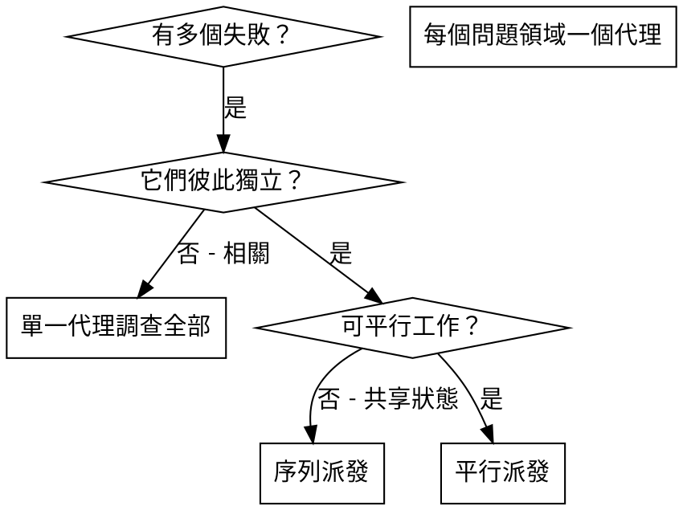

# 派發平行代理

## 概覽

你將任務委派給具專長的代理，並給予隔離脈絡。透過精準撰寫指令與背景，你能確保他們保持專注並完成任務。他們**不應**繼承你的會話脈絡或歷史 — 你要明確建構他們所需的資訊。這同時也能保留你自己的脈絡，以便做協調工作。

當你有多個不相關的失敗（不同測試檔、不同子系統、不同 bug），逐一調查會浪費時間。每個調查互不相依，可平行進行。

**核心原則：**每個獨立問題領域派一個代理，讓他們並行工作。

## 何時使用



**使用時機：**
- 3 個以上測試檔失敗且根因不同
- 多個子系統各自壞掉
- 每個問題可在不需要其他脈絡下理解
- 調查之間沒有共享狀態

**不要使用：**
- 失敗彼此相關（修一個可能會修好其他）
- 需要理解完整系統狀態
- 代理會互相干擾

## 模式

### 1. 識別獨立領域

依故障類型分組：
- 檔案 A 測試：工具核准流程
- 檔案 B 測試：批次完成行為
- 檔案 C 測試：中止功能

每個領域彼此獨立 — 修工具核准不會影響中止測試。

### 2. 建立聚焦的代理任務

每個代理拿到：
- **明確範圍：**一個測試檔或子系統
- **清楚目標：**讓這些測試通過
- **限制：**不要改動其他程式碼
- **預期輸出：**你發現與修正的摘要

### 3. 平行派發

```typescript
// In Claude Code / AI environment
Task("Fix agent-tool-abort.test.ts failures")
Task("Fix batch-completion-behavior.test.ts failures")
Task("Fix tool-approval-race-conditions.test.ts failures")
// All three run concurrently
```

### 4. 審查並整合

代理回來後：
- 讀取每個摘要
- 確認修正不衝突
- 跑完整測試
- 整合所有變更

## 代理提示結構

好的代理提示具備：
1. **聚焦** — 一個清楚的問題領域
2. **自足** — 理解問題所需的所有背景
3. **明確輸出** — 代理應回傳什麼

```markdown
Fix the 3 failing tests in src/agents/agent-tool-abort.test.ts:

1. "should abort tool with partial output capture" - expects 'interrupted at' in message
2. "should handle mixed completed and aborted tools" - fast tool aborted instead of completed
3. "should properly track pendingToolCount" - expects 3 results but gets 0

These are timing/race condition issues. Your task:

1. Read the test file and understand what each test verifies
2. Identify root cause - timing issues or actual bugs?
3. Fix by:
   - Replacing arbitrary timeouts with event-based waiting
   - Fixing bugs in abort implementation if found
   - Adjusting test expectations if testing changed behavior

Do NOT just increase timeouts - find the real issue.

Return: Summary of what you found and what you fixed.
```

## 常見錯誤

**❌ 太寬泛：**「修所有測試」— 代理會迷失
**✅ 具體：**「修 agent-tool-abort.test.ts」— 範圍明確

**❌ 無脈絡：**「修競態條件」— 代理不知道在哪裡
**✅ 有脈絡：**貼上錯誤訊息與測試名稱

**❌ 無限制：**代理可能把整個系統都重構
**✅ 有限制：**「不要改 production code」或「只修測試」

**❌ 輸出模糊：**「修好它」— 你不知道改了什麼
**✅ 明確：**「回報根因與變更摘要」

## 何時不要用

**失敗相關：**修一個可能會修好其他 — 先一起調查
**需要完整脈絡：**必須看整個系統才能理解
**探索性除錯：**你還不清楚壞了什麼
**共享狀態：**代理會互相干擾（編同檔案、用同資源）

## 會話中的真實例子

**情境：**重大重構後，3 個檔案共 6 個測試失敗

**失敗：**
- agent-tool-abort.test.ts：3 個失敗（時間/競態）
- batch-completion-behavior.test.ts：2 個失敗（工具未執行）
- tool-approval-race-conditions.test.ts：1 個失敗（執行次數 = 0）

**決策：**獨立領域 — 中止邏輯、批次完成、競態條件彼此獨立

**派發：**
```
Agent 1 → Fix agent-tool-abort.test.ts
Agent 2 → Fix batch-completion-behavior.test.ts
Agent 3 → Fix tool-approval-race-conditions.test.ts
```

**結果：**
- Agent 1：用事件等待取代 timeout
- Agent 2：修正事件結構 bug（threadId 放錯位置）
- Agent 3：新增等待非同步工具執行完成

**整合：**修正彼此獨立、無衝突、全套測試通過

**節省時間：**3 個問題平行解決，對比逐一處理

## 主要效益

1. **平行化** — 多個調查同時進行
2. **聚焦** — 每個代理範圍窄，脈絡較少
3. **獨立性** — 代理互不干擾
4. **速度** — 以 1 的時間完成 3

## 驗證

代理回來後：
1. **審查每份摘要** — 理解改了什麼
2. **檢查衝突** — 是否有代理改同一段程式碼
3. **執行完整測試** — 確認所有修正能一起運作
4. **抽樣檢查** — 代理可能犯系統性錯誤

## 真實影響

來自除錯會話（2025-10-03）：
- 3 個檔案共 6 個失敗
- 3 個代理平行派發
- 全部調查同步完成
- 全部修正成功整合
- 代理變更之間零衝突
