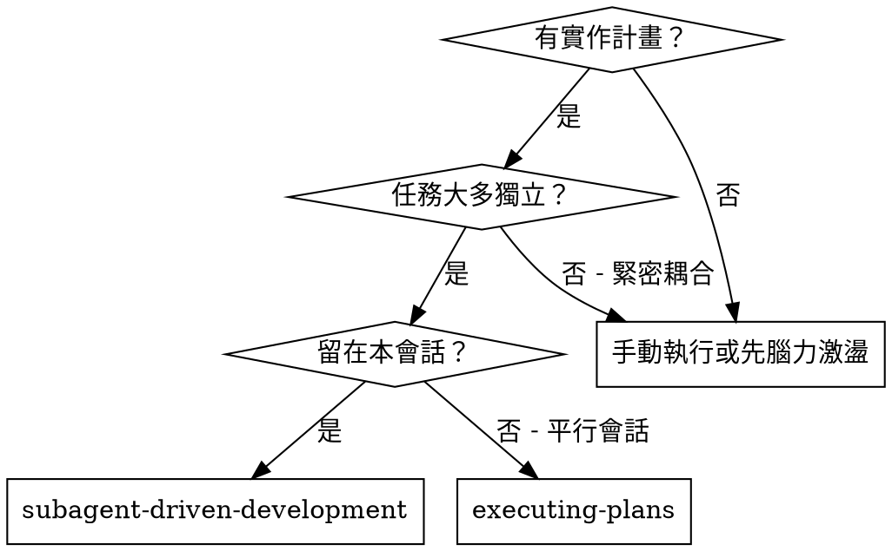
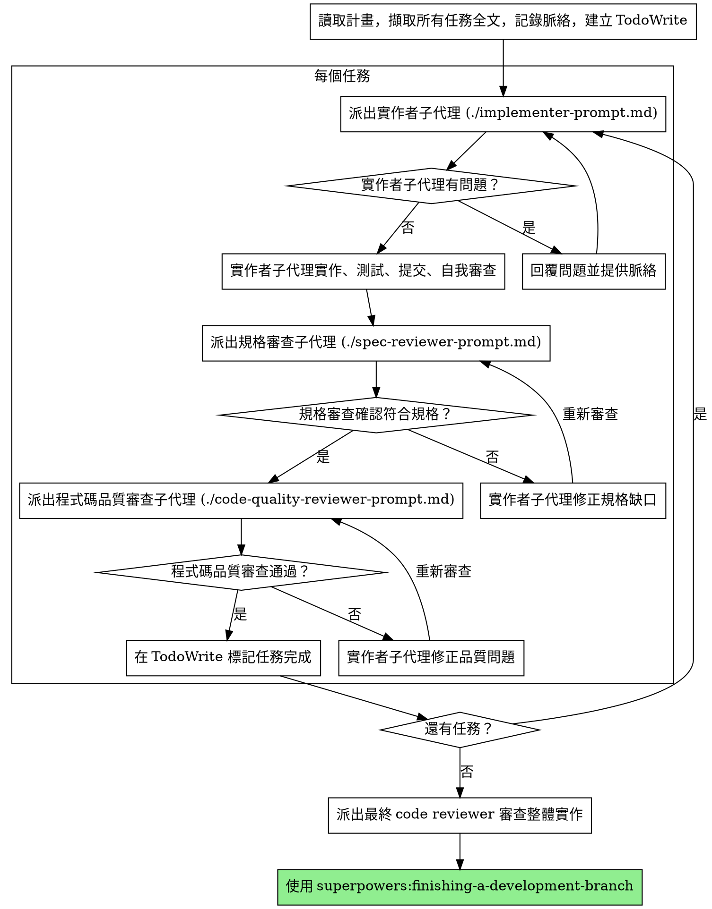

# 子代理驅動開發

透過「每個任務派新子代理」執行計畫，且每個任務後進行兩階段審查：先規格符合度，再程式碼品質。

**為何使用子代理：**你將任務委派給具專長的代理，並給予隔離脈絡。透過精準撰寫指令與背景，你能確保他們保持專注並完成任務。他們**不應**繼承你的會話脈絡或歷史 — 你要明確建構他們所需的資訊。這同時也保留你的脈絡，以便協調。

**核心原則：**每個任務一個新子代理 + 兩階段審查（先規格、再品質）= 高品質、快迭代

## 何時使用



**與 Executing Plans（平行會話）的差異：**
- 同一會話（不切換脈絡）
- 每個任務一個新子代理（避免脈絡污染）
- 每個任務後兩階段審查：先規格符合度，再程式碼品質
- 更快迭代（任務之間無需人介入）

## 流程



## 模型選擇

使用能勝任角色的最低能力模型，以節省成本並提高速度。

**機械式實作任務**（隔離函式、規格清楚、1-2 個檔案）：使用快速、便宜的模型。當計畫描述明確時，多數實作都是機械性的。

**整合與判斷任務**（多檔案協調、模式匹配、除錯）：使用標準模型。

**架構、設計與審查任務：**使用最強可用模型。

**任務複雜度訊號：**
- 只動 1-2 檔且規格完整 → 便宜模型
- 涉及多檔整合 → 標準模型
- 需要設計判斷或廣泛理解程式碼庫 → 最強模型

## 實作者狀態處理

實作者子代理會回報四種狀態，請依狀態處理：

**DONE：**進入規格符合度審查。

**DONE_WITH_CONCERNS：**已完成但有疑慮。先閱讀疑慮內容。若與正確性或範圍相關，先處理再審查。若只是觀察（例如「這個檔案變大了」），記錄後繼續審查。

**NEEDS_CONTEXT：**需要先前未提供的資訊。補齊脈絡後重新派發。

**BLOCKED：**無法完成任務。評估阻礙：
1. 若是脈絡問題，補齊脈絡並用同模型重派
2. 若需要更多推理，換更強模型重派
3. 若任務太大，拆成更小
4. 若計畫本身有問題，升級請使用者處理

**不要**忽略升級或在不做改變的情況下強迫同模型重試。實作者說卡住，就一定要改變。

## 提示範本

- `./implementer-prompt.md` - 派出實作者子代理
- `./spec-reviewer-prompt.md` - 派出規格符合度審查子代理
- `./code-quality-reviewer-prompt.md` - 派出程式碼品質審查子代理

## 範例流程

```
你：我正在使用子代理驅動開發來執行這份計畫。

[只讀一次計畫檔：docs/superpowers/plans/feature-plan.md]
[擷取全部 5 個任務的完整內容與脈絡]
[建立含全部任務的 TodoWrite]

任務 1：Hook 安裝腳本

[取得任務 1 內容與脈絡（已擷取）]
[派出實作者子代理，附完整任務內容 + 脈絡]

實作者：「開始前想確認 — hook 要安裝在使用者或系統層級？」

你：「使用者層級（~/.config/superpowers/hooks/）」

實作者：「了解，開始實作...」
[稍後] 實作者：
  - 已完成 install-hook 指令
  - 新增測試，5/5 通過
  - 自我審查：發現漏了 --force 旗標，已補上
  - 已提交

[派出規格符合度審查]
規格審查：✅ 符合規格 — 所有需求滿足，沒有多餘功能

[取得 git SHA，派出程式碼品質審查]
程式碼審查：優點：測試涵蓋好、乾淨。問題：無。通過。

[標記任務 1 完成]

任務 2：復原模式

[取得任務 2 內容與脈絡（已擷取）]
[派出實作者子代理，附完整任務內容 + 脈絡]

實作者：[無問題，直接進行]
實作者：
  - 新增 verify/repair 模式
  - 8/8 測試通過
  - 自我審查：沒問題
  - 已提交

[派出規格符合度審查]
規格審查：❌ 問題：
  - 缺少：進度回報（規格寫「每 100 筆回報一次」）
  - 多做：新增 --json 旗標（未要求）

[實作者修正問題]
實作者：移除 --json 旗標，加入進度回報

[規格審查再檢查]
規格審查：✅ 目前符合規格

[派出程式碼品質審查]
程式碼審查：優點：穩健。問題（Important）：Magic number（100）

[實作者修正]
實作者：抽出 PROGRESS_INTERVAL 常數

[程式碼審查再檢查]
程式碼審查：✅ 通過

[標記任務 2 完成]

...

[全部任務完成後]
[派出最終 code-reviewer]
最終審查：所有需求已滿足，可合併

完成！
```
