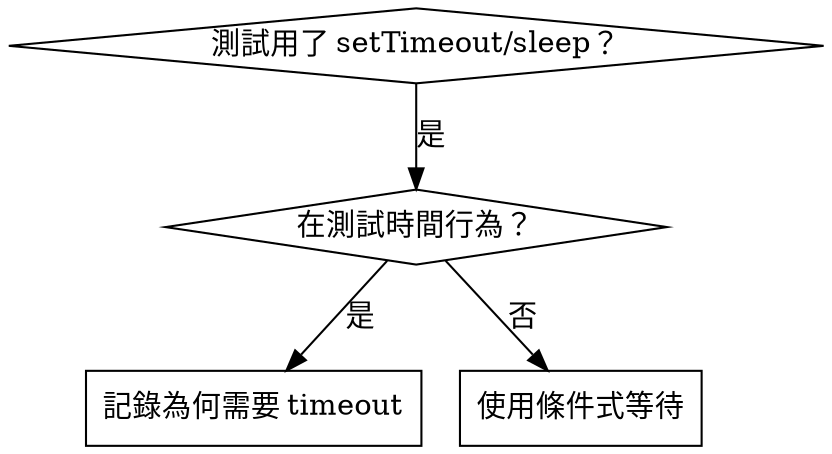

# 條件式等待

## 概覽

易脆弱的測試常用任意延遲來猜時間，造成競態：在快機器通過，但在高負載或 CI 失敗。

**核心原則：**等待你真正關心的條件，而不是猜測所需時間。

## 何時使用



**使用時機：**
- 測試含任意延遲（`setTimeout`、`sleep`、`time.sleep()`）
- 測試易脆弱（有時通過、有時在負載下失敗）
- 平行執行時測試逾時
- 等待非同步操作完成

**不要用在：**
- 測試真正的時間行為（debounce、throttle 間隔）
- 若使用任意 timeout，務必記錄原因

## 核心模式

```typescript
// ❌ BEFORE: Guessing at timing
await new Promise(r => setTimeout(r, 50));
const result = getResult();
expect(result).toBeDefined();

// ✅ AFTER: Waiting for condition
await waitFor(() => getResult() !== undefined);
const result = getResult();
expect(result).toBeDefined();
```

## 快速模式

| 情境 | 模式 |
|----------|---------|
| 等待事件 | `waitFor(() => events.find(e => e.type === 'DONE'))` |
| 等待狀態 | `waitFor(() => machine.state === 'ready')` |
| 等待數量 | `waitFor(() => items.length >= 5)` |
| 等待檔案 | `waitFor(() => fs.existsSync(path))` |
| 複雜條件 | `waitFor(() => obj.ready && obj.value > 10)` |

## 實作

通用輪詢函式：
```typescript
async function waitFor<T>(
  condition: () => T | undefined | null | false,
  description: string,
  timeoutMs = 5000
): Promise<T> {
  const startTime = Date.now();

  while (true) {
    const result = condition();
    if (result) return result;

    if (Date.now() - startTime > timeoutMs) {
      throw new Error(`Timeout waiting for ${description} after ${timeoutMs}ms`);
    }

    await new Promise(r => setTimeout(r, 10)); // Poll every 10ms
  }
}
```

本目錄下的 `condition-based-waiting-example.ts` 有完整實作，以及來自實際除錯會話的領域輔助函式（`waitForEvent`、`waitForEventCount`、`waitForEventMatch`）。

## 常見錯誤

**❌ 輪詢太快：**`setTimeout(check, 1)` — 浪費 CPU
**✅ 修正：**每 10ms 輪詢一次

**❌ 沒有 timeout：**條件永遠不成立就會無限迴圈
**✅ 修正：**永遠設定 timeout，且錯誤訊息要清楚

**❌ 資料過期：**在迴圈前快取狀態
**✅ 修正：**在迴圈內呼叫 getter 取得最新資料

## 何時任意 timeout 才是正確

```typescript
// Tool ticks every 100ms - need 2 ticks to verify partial output
await waitForEvent(manager, 'TOOL_STARTED'); // First: wait for condition
await new Promise(r => setTimeout(r, 200));   // Then: wait for timed behavior
// 200ms = 2 ticks at 100ms intervals - documented and justified
```

**要求：**
1. 先等待觸發條件
2. 依已知時間而非猜測
3. 註解說明原因

## 真實影響

來自除錯會話（2025-10-03）：
- 修復 3 個檔案中的 15 個易脆弱測試
- 通過率：60% → 100%
- 執行時間：快 40%
- 不再有競態
