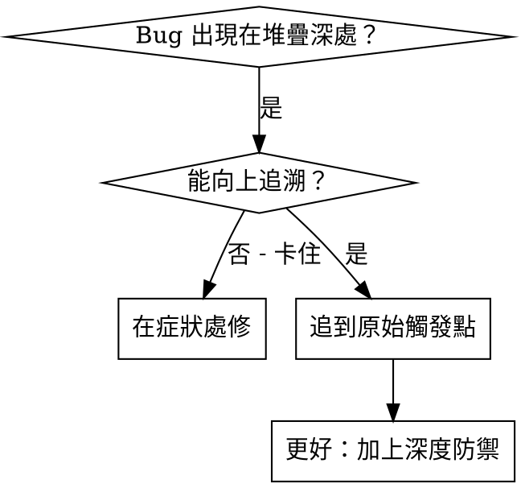
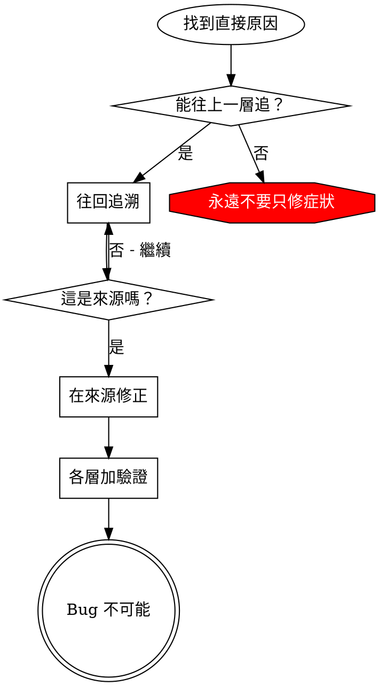

# 根因追溯

## 概覽

Bug 常常在呼叫堆疊的深處顯現（例如 git init 在錯的目錄、檔案建立在錯的位置、資料庫用錯路徑開啟）。直覺會在錯誤出現處修，但那只是治標。

**核心原則：**沿著呼叫鏈往回追到最初觸發點，並在來源修正。

## 何時使用



**使用時機：**
- 錯誤在執行深處發生（不是入口點）
- 堆疊追蹤顯示很長的呼叫鏈
- 不清楚無效資料從哪裡來
- 需要找出是哪個測試/程式碼觸發

## 追溯流程

### 1. 觀察症狀
```
Error: git init failed in /Users/jesse/project/packages/core
```

### 2. 找出直接原因
**哪段程式碼直接造成這個？**
```typescript
await execFileAsync('git', ['init'], { cwd: projectDir });
```

### 3. 問：是誰呼叫它？
```typescript
WorktreeManager.createSessionWorktree(projectDir, sessionId)
  → called by Session.initializeWorkspace()
  → called by Session.create()
  → called by test at Project.create()
```

### 4. 繼續往上追
**傳入了什麼值？**
- `projectDir = ''`（空字串！）
- 空字串作為 `cwd` 會解析為 `process.cwd()`
- 也就是原始碼目錄！

### 5. 找出原始觸發點
**空字串從哪裡來？**
```typescript
const context = setupCoreTest(); // Returns { tempDir: '' }
Project.create('name', context.tempDir); // Accessed before beforeEach!
```

## 加入堆疊追蹤

當你無法手動追溯時，加入儀表化：

```typescript
// Before the problematic operation
async function gitInit(directory: string) {
  const stack = new Error().stack;
  console.error('DEBUG git init:', {
    directory,
    cwd: process.cwd(),
    nodeEnv: process.env.NODE_ENV,
    stack,
  });

  await execFileAsync('git', ['init'], { cwd: directory });
}
```

**關鍵：**在測試中用 `console.error()`（不要用 logger — 可能看不到）

**執行並擷取：**
```bash
npm test 2>&1 | grep 'DEBUG git init'
```

**分析堆疊追蹤：**
- 找出測試檔名
- 找到觸發呼叫的行號
- 辨識模式（同一測試？同一參數？）

## 找出是哪個測試造成污染

若某個東西在測試中出現，但你不知道是哪個測試：

使用本目錄的二分腳本 `find-polluter.sh`：

```bash
./find-polluter.sh '.git' 'src/**/*.test.ts'
```

它會逐一執行測試，並在第一個污染者停止。使用方式見腳本說明。

## 真實例子：空的 projectDir

**症狀：**`.git` 建在 `packages/core/`（原始碼）

**追溯鏈：**
1. `git init` 在 `process.cwd()` 執行 ← 空 cwd 參數
2. WorktreeManager 被空 projectDir 呼叫
3. Session.create() 傳入空字串
4. 測試在 beforeEach 前存取 `context.tempDir`
5. setupCoreTest() 一開始回傳 `{ tempDir: '' }`

**根因：**頂層變數初始化讀取到空值

**修正：**把 tempDir 改成 getter，若 beforeEach 前存取就丟錯

**同時加上深度防禦：**
- 第 1 層：Project.create() 驗證目錄
- 第 2 層：WorkspaceManager 驗證非空
- 第 3 層：NODE_ENV guard 拒絕在 tmpdir 外 git init
- 第 4 層：git init 前加入 stack trace 記錄

## 核心原則



**永遠不要只修錯誤出現的地方。**往回追到原始觸發點。

## 堆疊追蹤提示

**在測試中：**用 `console.error()` 不要用 logger — logger 可能被抑制
**在操作前：**在危險操作之前記錄，而不是失敗後
**包含脈絡：**目錄、cwd、環境變數、時間戳
**擷取堆疊：**`new Error().stack` 顯示完整呼叫鏈

## 真實影響

來自除錯會話（2025-10-03）：
- 透過 5 層追溯找到根因
- 在來源修正（getter 驗證）
- 加了 4 層防禦
- 1847 個測試通過，零污染
