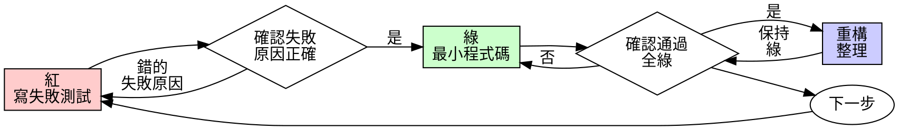

# 測試驅動開發（TDD）

## 概覽

先寫測試。看它失敗。再寫最小程式碼讓它通過。

**核心原則：**如果你沒看過測試失敗，就不知道它是否真的測到重點。

**違反規則的字面，就是違反規則的精神。**

## 何時使用

**永遠：**
- 新功能
- 修 bug
- 重構
- 行為變更

**例外（詢問使用者）：**
- 一次性原型
- 生成式程式碼
- 設定檔

想到「就這一次不做 TDD」？停下來。那是合理化。

## 鐵則

```
在有失敗測試之前，不得寫任何 production code
```

先寫程式碼再寫測試？刪掉它，重來。

**沒有例外：**
- 不要保留作為「參考」
- 不要在寫測試時「順便調整」
- 不要看它
- 刪掉就是刪掉

從測試重新實作。就是如此。

## 紅-綠-重構



### 紅 - 寫失敗測試

寫一個最小測試，展示應該發生什麼。

<Good>
```typescript
test('retries failed operations 3 times', async () => {
  let attempts = 0;
  const operation = () => {
    attempts++;
    if (attempts < 3) throw new Error('fail');
    return 'success';
  };

  const result = await retryOperation(operation);

  expect(result).toBe('success');
  expect(attempts).toBe(3);
});
```
命名清楚、測真實行為、只測一件事
</Good>

<Bad>
```typescript
test('retry works', async () => {
  const mock = jest.fn()
    .mockRejectedValueOnce(new Error())
    .mockRejectedValueOnce(new Error())
    .mockResolvedValueOnce('success');
  await retryOperation(mock);
  expect(mock).toHaveBeenCalledTimes(3);
});
```
名稱模糊、測的是 mock 而不是程式碼
</Bad>

**要求：**
- 一個行為
- 清楚命名
- 真實程式碼（除非不可避免，不要用 mock）

### 驗證紅 - 看它失敗

**必須做，永遠不可跳過。**

```bash
npm test path/to/test.test.ts
```

確認：
- 測試失敗（不是 error）
- 失敗訊息符合預期
- 因為功能缺失而失敗（不是拼字錯）

**測試通過？**你測到既有行為。修測試。

**測試報錯？**修錯誤，重跑直到正確失敗。

### 綠 - 最小程式碼

寫最簡單的程式碼讓測試通過。

<Good>
```typescript
async function retryOperation<T>(fn: () => Promise<T>): Promise<T> {
  for (let i = 0; i < 3; i++) {
    try {
      return await fn();
    } catch (e) {
      if (i === 2) throw e;
    }
  }
  throw new Error('unreachable');
}
```
剛好夠通過
</Good>

<Bad>
```typescript
async function retryOperation<T>(
  fn: () => Promise<T>,
  options?: {
    maxRetries?: number;
    backoff?: 'linear' | 'exponential';
    onRetry?: (attempt: number) => void;
  }
): Promise<T> {
  // YAGNI
}
```
過度工程
</Bad>

不要增加功能、重構其他程式碼，或「順便改善」超出測試範圍的內容。

### 驗證綠 - 看它通過

**必須做。**

```bash
npm test path/to/test.test.ts
```

確認：
- 測試通過
- 其他測試也通過
- 輸出乾淨（無錯誤、無警告）

**測試失敗？**修程式碼，不修測試。

**其他測試失敗？**立刻修。

### 重構 - 整理

只有在綠之後：
- 移除重複
- 改善命名
- 抽出 helper

保持測試全綠，不要新增行為。

### 重複

下一個功能就寫下一個失敗測試。

## 好的測試

| 品質 | 好 | 壞 |
|---------|------|-----|
| **最小** | 一件事。名稱有「and」？拆開。 | `test('validates email and domain and whitespace')` |
| **清楚** | 名稱描述行為 | `test('test1')` |
| **表達意圖** | 展示期望的 API | 模糊應該怎麼用 |

## 為何順序重要

**「我先寫程式碼，再補測試驗證」**

事後寫測試會立刻通過。立刻通過並不能證明什麼：
- 可能測錯東西
- 可能測的是實作而非行為
- 可能漏掉你忘記的邊界
- 你從沒看過它抓到 bug

先測試會逼你看見失敗，證明它真的有測到東西。

**「我已手動測過所有邊界」**

手動測試是臨時性的。你以為都測了，但：
- 沒有紀錄
- 程式碼變更後無法重跑
- 壓力下容易遺漏
- 「我試過可行」≠ 完整

自動化測試是系統化的，每次都用同樣方式跑。

**「刪掉 X 小時的工作很浪費」**

沉沒成本謬誤。時間已經花掉了。你現在的選擇：
- 刪掉重寫（多 X 小時，高信心）
- 留著，事後補測試（30 分鐘，低信心，可能有 bug）

「浪費」是在保留你無法信任的程式碼。沒有真實測試的程式碼就是技術債。

**「TDD 太教條，務實就是要調整」**

TDD 本來就務實：
- 提交前抓 bug（比事後除錯快）
- 防止回歸（測試立即抓破壞）
- 文件化行為（測試展示如何使用）
- 允許重構（放心改，測試會抓）

「務實」捷徑 = 生產環境除錯 = 更慢。

**「事後測試也能達到一樣效果 — 重點在精神」**

不行。事後測試回答「它做了什麼？」先測試回答「它應該做什麼？」

事後測試受到你的實作影響。你測你做的，而不是需求。你驗證你記得的邊界，而不是被迫發現的邊界。

先測試迫使你在實作前發現邊界。事後測試只是驗證你是否記得全部（你沒有）。

事後 30 分鐘測試 ≠ TDD。你得到覆蓋率，失去測試是否有效的證明。

## 常見合理化

| 藉口 | 現實 |
|--------|---------|
| 「太簡單，不用測」 | 簡單的也會壞，測試只要 30 秒。 |
| 「我會事後測」 | 立即通過的測試不能證明任何事。 |
| 「事後測也能達到相同目的」 | 事後測 =「它做了什麼？」先測 =「它應該做什麼？」 |
| 「已手動測過」 | 臨時測試 ≠ 系統化。沒有紀錄、不能重跑。 |
| 「刪掉 X 小時太浪費」 | 沉沒成本謬誤。保留未驗證程式碼是技術債。 |
| 「留著當參考，測試先寫」 | 你會照著改，等於事後測。刪掉就是刪掉。 |
| 「需要先探索」 | 可以探索，但要丟掉探索，再用 TDD 開始。 |
| 「難測代表設計不清楚」 | 聽測試的。難測 = 難用。 |
| 「TDD 會拖慢」 | TDD 比除錯快。務實 = 先測。 |
| 「手動測更快」 | 手動無法證明邊界，且每次改動都要再測。 |
| 「既有程式碼沒測試」 | 你在改善它，替既有程式碼補測試。 |

## 紅旗 - 停止並重來

- 先寫程式碼再寫測試
- 事後補測試
- 測試一開始就通過
- 無法解釋為何測試失敗
- 測試「之後再補」
- 合理化「就這一次」
- 「我已手動測過」
- 「事後測也能達到同樣效果」
- 「重點在精神不是儀式」
- 「留著當參考」或「改寫現有程式碼」
- 「已經花 X 小時，刪掉浪費」
- 「TDD 太教條，我很務實」
- 「這次不一樣...」

**以上任何一項都代表：刪掉程式碼，重新用 TDD 開始。**

## 範例：修 bug

**Bug：**空 email 被接受

**紅**
```typescript
test('rejects empty email', async () => {
  const result = await submitForm({ email: '' });
  expect(result.error).toBe('Email required');
});
```

**驗證紅**
```bash
$ npm test
FAIL: expected 'Email required', got undefined
```

**綠**
```typescript
function submitForm(data: FormData) {
  if (!data.email?.trim()) {
    return { error: 'Email required' };
  }
  // ...
}
```

**驗證綠**
```bash
$ npm test
PASS
```

**重構**
如有需要，抽出多欄位驗證。

## 驗證檢查表

在標記完成前：

- [ ] 每個新函式/方法都有測試
- [ ] 每個測試都看過失敗才實作
- [ ] 每個測試失敗原因符合預期（功能缺失非拼字）
- [ ] 以最小程式碼讓每個測試通過
- [ ] 全部測試通過
- [ ] 輸出乾淨（無錯誤、警告）
- [ ] 測試使用真實程式碼（除非不可避免才用 mock）
- [ ] 邊界情況與錯誤都有涵蓋

無法勾完？你跳過了 TDD。重來。

## 卡住時

| 問題 | 解法 |
|---------|----------|
| 不知道怎麼測 | 寫出你希望的 API。先寫 assertion。詢問使用者。 |
| 測試太複雜 | 設計太複雜。簡化介面。 |
| 什麼都得 mock | 程式碼耦合太高。用依賴注入。 |
| 測試設定很大 | 抽出 helper。還是很複雜？簡化設計。 |

## 除錯整合

發現 bug？寫一個能重現的失敗測試，走 TDD 循環。測試能證明修正，也能防回歸。

不要在沒有測試的情況下修 bug。

## 測試反模式

新增 mock 或測試工具時，閱讀 @testing-anti-patterns.md 以避免常見陷阱：
- 測 mock 行為而非真實行為
- 為 production class 加入只供測試的方法
- 未理解相依就大量 mock

## 最終規則

```
Production code → test exists and failed first
Otherwise → not TDD
```

除非使用者允許，沒有例外。
