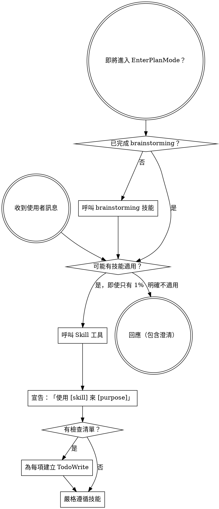

<SUBAGENT-STOP>
若你是作為子代理被派遣來執行特定任務，請跳過此技能。
</SUBAGENT-STOP>

<EXTREMELY-IMPORTANT>
只要你認為有 1% 的可能性某個技能適用於你正在做的事，你就**絕對必須**呼叫該技能。

若技能適用於你的任務，你沒有選擇權，你**必須**使用它。

這不可協商。這不是可選項。你不能用任何理由規避。
</EXTREMELY-IMPORTANT>

## 指令優先序

Superpowers 技能會覆寫預設系統提示行為，但**使用者指令永遠優先**：

1. **使用者的明確指令**（CLAUDE.md、GEMINI.md、AGENTS.md、直接要求）— 最高優先
2. **Superpowers 技能** — 與預設系統行為衝突時優先
3. **預設系統提示** — 最低優先

若 CLAUDE.md、GEMINI.md 或 AGENTS.md 說「不要使用 TDD」，而技能說「永遠使用 TDD」，請遵循使用者指令。使用者才是主導。

## 如何存取技能

**在 Claude Code：**使用 `Skill` 工具。呼叫技能後，其內容會載入並呈現給你——請直接遵循。不要用 Read 工具讀取技能檔案。

**在 Gemini CLI：**技能透過 `activate_skill` 工具啟用。Gemini 會在會話開始載入技能中繼資料，並在需要時載入完整內容。

**在其他環境：**請查閱平台文件了解技能載入方式。

## 平台適配

技能使用 Claude Code 的工具名稱。非 Claude Code 平台：請參考 `references/codex-tools.md`（Codex）取得對應工具。Gemini CLI 使用者會透過 GEMINI.md 自動載入工具對應。

# 使用技能

## 規則

**在任何回應或動作前，先呼叫相關或被要求的技能。**即使只有 1% 的可能性技能適用，也應先呼叫以確認。若呼叫後發現不適用，就不必使用它。

## 紅旗

出現以下想法表示你在合理化，請停下：

| 想法 | 現實 |
|---------|---------|
| 「這只是個簡單問題」 | 問題也是任務。檢查技能。 |
| 「我需要先更多背景」 | 技能檢查在澄清問題之前。 |
| 「先看看程式碼庫」 | 技能會告訴你怎麼探索。先檢查。 |
| 「先快速看 git/檔案」 | 檔案沒有對話脈絡。先檢查技能。 |
| 「先蒐集資訊」 | 技能會告訴你怎麼蒐集。 |
| 「這不需要正式技能」 | 只要有技能，就用它。 |
| 「我記得這個技能」 | 技能會演進。讀最新版。 |
| 「這不算任務」 | 有動作就是任務。檢查技能。 |
| 「技能太過頭」 | 簡單事常變複雜。用技能。 |
| 「我先做這一件事」 | 任何事之前先檢查。 |
| 「這樣好像很有進度」 | 沒紀律的行動會浪費時間。技能避免這件事。 |
| 「我知道那是什麼」 | 知道概念 ≠ 使用技能。呼叫它。 |

## 技能優先序

多個技能可能適用時，請依以下順序：

1. **先流程技能**（brainstorming、debugging）- 這些決定如何處理任務
2. **再實作技能**（frontend-design、mcp-builder）- 這些指引執行方式

「我們來做 X」→ 先 brainstorming，再進入實作技能。
「修這個 bug」→ 先 debugging，再進入領域技能。

## 技能類型

**嚴格型**（TDD、debugging）：照做，不要自行降低紀律。

**彈性型**（patterns）：依情境調整原則。

技能本身會告訴你是哪一種。

## 使用者指令

使用者指令告訴你「要做什麼」，不是「怎麼做」。
「加入 X」或「修好 Y」不代表可以跳過流程。
