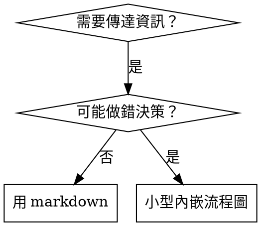

# 撰寫技能

## 概覽

**撰寫技能＝把測試驅動開發（TDD）套用到流程文件。**

**個人技能放在代理專用目錄（Claude Code 用 `~/.claude/skills`，Codex 用 `~/.agents/skills/`）**

你先寫測試情境（含子代理的壓力場景），看它失敗（基線行為），再寫技能（文件），看測試通過（代理遵循），最後重構（補洞）。

**核心原則：**若你沒有看過「沒有技能時」代理會失敗，就不知道技能是否教對。

**必備背景：**使用本技能前，你必須理解 superpowers:test-driven-development。該技能定義了 RED-GREEN-REFACTOR 循環。本技能把 TDD 應用到文件。

**官方指引：**Anthropic 的官方技能撰寫最佳實務請見 anthropic-best-practices.md。本文件提供額外的模式與指引，用於補足本技能聚焦的 TDD 方法。

## 什麼是技能？

**技能**是對已驗證技巧、模式或工具的參考指南。它幫助未來的 Claude 找到並套用有效方法。

**技能是：**可重用的技巧、模式、工具、參考指南

**技能不是：**一次性解題的敘事

## 技能版 TDD 對照

| TDD 概念 | 技能建立 |
|-------------|----------------|
| **測試案例** | 子代理壓力情境 |
| **Production code** | 技能文件（SKILL.md） |
| **測試失敗（RED）** | 沒有技能時代理違規（基線） |
| **測試通過（GREEN）** | 技能存在時代理遵循 |
| **重構** | 補洞但保持遵循 |
| **先寫測試** | 寫技能前先跑基線情境 |
| **看它失敗** | 記錄代理的合理化語句 |
| **最小實作** | 寫技能只解決特定違規 |
| **看它通過** | 驗證代理遵循 |
| **重構循環** | 找到新合理化 → 補洞 → 重新驗證 |

整個技能建立流程遵循 RED-GREEN-REFACTOR。

## 何時建立技能

**建立時機：**
- 技巧對你來說不直覺
- 你會跨專案重複引用
- 模式適用範圍廣（非專案特定）
- 對其他人有幫助

**不要建立：**
- 一次性解法
- 已有完善文件的標準實務
- 專案特定慣例（放到 CLAUDE.md）
- 可用 regex/驗證強制的機械規則（能自動化就自動化，把文件留給需要判斷的事）

## 技能類型

### 技術（Technique）
具體方法與步驟（condition-based-waiting、root-cause-tracing）

### 模式（Pattern）
思考方式（flatten-with-flags、test-invariants）

### 參考（Reference）
API 文件、語法指南、工具文件（office docs）

## 目錄結構

```
skills/
  skill-name/
    SKILL.md              # Main reference (required)
    supporting-file.*     # Only if needed
```

**扁平命名空間** — 所有技能在同一個可搜尋空間

**拆分檔案適用：**
1. **重型參考**（100+ 行）— API 文件、完整語法
2. **可重用工具** — 腳本、工具、模板

**保持內嵌：**
- 原則與概念
- 程式碼模式（< 50 行）
- 其他內容

## SKILL.md 結構

**Frontmatter（YAML）：**
- 只支援兩個欄位：`name` 與 `description`
- 總長度最多 1024 字元
- `name`：只用字母、數字、連字號（不可有括號、特殊字元）
- `description`：第三人稱，只描述「何時使用」（不要描述做了什麼）
  - 以 "Use when..." 開頭，聚焦觸發條件
  - 包含明確症狀、情境與上下文
  - **絕不要在 description 摘要流程或工作流**（原因見 CSO）
  - 盡量小於 500 字元

```markdown
---
name: Skill-Name-With-Hyphens
description: Use when [specific triggering conditions and symptoms]
---

# Skill Name

## Overview
What is this? Core principle in 1-2 sentences.

## When to Use
[Small inline flowchart IF decision non-obvious]

Bullet list with SYMPTOMS and use cases
When NOT to use

## Core Pattern (for techniques/patterns)
Before/after code comparison

## Quick Reference
Table or bullets for scanning common operations

## Implementation
Inline code for simple patterns
Link to file for heavy reference or reusable tools

## Common Mistakes
What goes wrong + fixes

## Real-World Impact (optional)
Concrete results
```


## Claude 搜尋最佳化（CSO）

**對可發現性至關重要：**未來的 Claude 需要能找到你的技能

### 1. 豐富的描述欄位

**目的：**Claude 會讀 description 來判斷是否要載入技能。它必須能回答：「我現在需要讀這個技能嗎？」

**格式：**以 "Use when..." 開頭，聚焦觸發條件

**關鍵：description = 何時使用，而不是技能流程**

description 只應描述觸發條件，不要摘要技能流程。

**為何重要：**測試發現當 description 摘要流程時，Claude 會照 description 走，而不讀完整技能內容。某技能 description 寫「任務間做 code review」導致 Claude 只做一次 review，即使流程圖清楚要求兩次（先規格符合度再程式碼品質）。

當 description 改成只寫「Use when executing implementation plans with independent tasks」（不摘要流程），Claude 才會讀流程圖並正確執行兩階段審查。

**陷阱：**摘要流程的 description 會成為 Claude 的捷徑，導致技能本體變成被跳過的文件。

```yaml
# ❌ BAD: Summarizes workflow - Claude may follow this instead of reading skill
description: Use when executing plans - dispatches subagent per task with code review between tasks

# ❌ BAD: Too much process detail
description: Use for TDD - write test first, watch it fail, write minimal code, refactor

# ✅ GOOD: Just triggering conditions, no workflow summary
description: Use when executing implementation plans with independent tasks in the current session

# ✅ GOOD: Triggering conditions only
description: Use when implementing any feature or bugfix, before writing implementation code
```

**內容要點：**
- 使用具體觸發條件、症狀與情境
- 描述*問題*（競態、不一致行為），而不是*語言特徵*（setTimeout、sleep）
- 觸發條件盡量與技術無關，除非技能本身是技術特定
- 若技能是技術特定，請在觸發條件中明確表達
- 用第三人稱（會被注入系統提示）
- **絕不要摘要技能流程**

```yaml
# ❌ BAD: Too abstract, vague, doesn't include when to use
description: For async testing

# ❌ BAD: First person
description: I can help you with async tests when they're flaky

# ❌ BAD: Mentions technology but skill isn't specific to it
description: Use when tests use setTimeout/sleep and are flaky

# ✅ GOOD: Starts with "Use when", describes problem, no workflow
description: Use when tests have race conditions, timing dependencies, or pass/fail inconsistently

# ✅ GOOD: Technology-specific skill with explicit trigger
description: Use when using React Router and handling authentication redirects
```

### 2. 關鍵字覆蓋

使用 Claude 會搜尋的詞：
- 錯誤訊息：「Hook timed out」「ENOTEMPTY」「race condition」
- 症狀：「flaky」「hanging」「zombie」「pollution」
- 同義詞：「timeout/hang/freeze」「cleanup/teardown/afterEach」
- 工具：實際指令、函式庫名稱、檔案類型

### 3. 描述性命名

**使用主動語態、動詞開頭：**
- ✅ `creating-skills` 而不是 `skill-creation`
- ✅ `condition-based-waiting` 而不是 `async-test-helpers`

### 4. Token 效率（關鍵）

**問題：**getting-started 與常用技能會載入到每個對話。每個 token 都很重要。

**目標字數：**
- getting-started 流程：每個 <150 字
- 常載入技能：總計 <200 字
- 其他技能：<500 字（仍要精簡）

**技巧：**

**把細節移到工具說明：**
```bash
# ❌ BAD: Document all flags in SKILL.md
search-conversations supports --text, --both, --after DATE, --before DATE, --limit N

# ✅ GOOD: Reference --help
search-conversations supports multiple modes and filters. Run --help for details.
```

**使用交叉引用：**
```markdown
# ❌ BAD: Repeat workflow details
When searching, dispatch subagent with template...
[20 lines of repeated instructions]

# ✅ GOOD: Reference other skill
Always use subagents (50-100x context savings). REQUIRED: Use [other-skill-name] for workflow.
```

**壓縮範例：**
```markdown
# ❌ BAD: Verbose example (42 words)
your human partner: "How did we handle authentication errors in React Router before?"
You: I'll search past conversations for React Router authentication patterns.
[Dispatch subagent with search query: "React Router authentication error handling 401"]

# ✅ GOOD: Minimal example (20 words)
Partner: "How did we handle auth errors in React Router?"
You: Searching...
[Dispatch subagent → synthesis]
```

**消除重複：**
- 不重複交叉引用中的內容
- 不解釋指令一眼就懂的部分
- 不要用多個範例展示同一模式

**驗證：**
```bash
wc -w skills/path/SKILL.md
# getting-started workflows: aim for <150 each
# Other frequently-loaded: aim for <200 total
```

**依「你做什麼」或核心洞見命名：**
- ✅ `condition-based-waiting` > `async-test-helpers`
- ✅ `using-skills` 不用 `skill-usage`
- ✅ `flatten-with-flags` > `data-structure-refactoring`
- ✅ `root-cause-tracing` > `debugging-techniques`

**動名詞（-ing）適合流程：**
- `creating-skills`、`testing-skills`、`debugging-with-logs`
- 具行動性，描述你正在做的事

### 4. 交叉引用其他技能

**在文件中引用其他技能時：**

只用技能名稱，並明確標示必要性：
- ✅ Good: `**REQUIRED SUB-SKILL:** Use superpowers:test-driven-development`
- ✅ Good: `**REQUIRED BACKGROUND:** You MUST understand superpowers:systematic-debugging`
- ❌ Bad: `See skills/testing/test-driven-development`（不清楚是否必須）
- ❌ Bad: `@skills/testing/test-driven-development/SKILL.md`（強制載入、浪費脈絡）

**為什麼不能用 @ 連結：**`@` 會立即載入檔案，還沒需要就消耗 200k+ 脈絡。

## 流程圖使用



**只在以下情況使用流程圖：**
- 決策點不直覺
- 可能太早停下的流程迴圈
- 「何時用 A vs B」的選擇

**不要在以下情況使用流程圖：**
- 參考材料 → 用表格、清單
- 程式碼範例 → 用 Markdown 區塊
- 線性指令 → 用編號清單
- 無語意的標籤（step1, helper2）

Graphviz 風格規範請見 @graphviz-conventions.dot。

**給使用者視覺化：**本目錄的 `render-graphs.js` 可將技能流程圖渲染成 SVG：
```bash
./render-graphs.js ../some-skill           # Each diagram separately
./render-graphs.js ../some-skill --combine # All diagrams in one SVG
```

## 程式碼範例

**一個優秀範例勝過多個普通範例**

選擇最相關的語言：
- 測試技巧 → TypeScript/JavaScript
- 系統除錯 → Shell/Python
- 資料處理 → Python

**好範例特徵：**
- 完整可執行
- 有註解說明「為何」
- 來自真實情境
- 模式清楚
- 可直接改用（非通用模板）

**不要：**
- 用 5+ 語言實作
- 做填空模板
- 寫硬湊範例

你很會移植 — 一個好範例就夠。

## 檔案組織

### 自足技能
```
defense-in-depth/
  SKILL.md    # Everything inline
```
適用：內容能放下，不需重型參考

### 含可重用工具的技能
```
condition-based-waiting/
  SKILL.md    # Overview + patterns
  example.ts  # Working helpers to adapt
```
適用：工具是可重用程式碼，不只是敘事

### 含重型參考的技能
```
pptx/
  SKILL.md       # Overview + workflows
  pptxgenjs.md   # 600 lines API reference
  ooxml.md       # 500 lines XML structure
  scripts/       # Executable tools
```
適用：參考資料太大，不適合內嵌

## 鐵則（同 TDD）

```
沒有失敗測試，就沒有技能
```

適用於新技能與既有技能的修改。

先寫技能再測試？刪掉重來。
修改技能不測試？同樣違規。

**沒有例外：**
- 不是「小修改」就可以
- 不是「只加一段」就可以
- 不是「只是更新文件」就可以
- 不要保留未測試變更作為「參考」
- 測試時不要「順便改」
- 刪掉就是刪掉

**必備背景：**superpowers:test-driven-development 說明了為何重要。同樣原則適用於文件。

## 測試所有技能類型

不同技能類型需要不同測試方式：

### 紀律型技能（規則/要求）

**範例：**TDD、verification-before-completion、designing-before-coding

**測試方式：**
- 學術題：是否理解規則？
- 壓力情境：是否在壓力下遵循？
- 多重壓力：時間 + 沉沒成本 + 疲勞
- 找出合理化並加上明確反制

**成功標準：**在最大壓力下仍遵循規則

### 技術型技能（how-to 指南）

**範例：**condition-based-waiting、root-cause-tracing、defensive-programming

**測試方式：**
- 應用情境：能否正確應用？
- 變體情境：能否處理邊界情況？
- 缺資訊測試：指引是否有空缺？

**成功標準：**能把技巧套到新情境

### 模式型技能（心智模型）

**範例：**reducing-complexity、information-hiding concepts

**測試方式：**
- 辨識情境：是否知道何時適用？
- 應用情境：能否使用心智模型？
- 反例情境：知道何時不適用？

**成功標準：**正確判斷何時/如何使用

### 參考型技能（文件/API）

**範例：**API 文件、指令參考、函式庫指南

**測試方式：**
- 取用情境：能否找到正確資訊？
- 應用情境：能否正確套用？
- 缺口測試：常見使用情境是否涵蓋？

**成功標準：**能找到並正確使用參考資訊

## 跳過測試的常見合理化

| 藉口 | 現實 |
|--------|---------|
| 「技能很清楚」 | 對你清楚 ≠ 對其他代理清楚。測試。 |
| 「只是參考」 | 參考也可能有缺口或不清楚。測試取用。 |
| 「測試太過頭」 | 未測試的技能一定有問題。15 分鐘測試能省數小時。 |
| 「有問題再測」 | 出問題 = 代理不會用技能。部署前測。 |
| 「測試太麻煩」 | 測試比線上除錯壞技能更省事。 |
| 「我很有信心」 | 過度自信保證出問題。還是要測。 |
| 「學術審查就夠」 | 讀 ≠ 用。測試應用情境。 |
| 「沒時間測試」 | 部署未測試技能更浪費時間。 |

**上述任何理由都代表：部署前測試，沒有例外。**

## 強化技能以抵抗合理化

強制紀律的技能（如 TDD）需要抵抗合理化。代理很聰明，在壓力下會找到漏洞。

**心理學提示：**理解說服技巧為何有效，有助於系統化使用。參考 persuasion-principles.md 的研究基礎（Cialdini, 2021; Meincke et al., 2025）關於權威、承諾、稀缺、社會認同與團結原則。

### 明確封住每個漏洞

不要只陳述規則 — 要禁止具體規避手法：

<Bad>
```markdown
Write code before test? Delete it.
```
</Bad>

<Good>
```markdown
Write code before test? Delete it. Start over.

**No exceptions:**
- Don't keep it as "reference"
- Don't "adapt" it while writing tests
- Don't look at it
- Delete means delete
```
</Good>

### 處理「精神 vs 字面」論述

提前加入基礎原則：

```markdown
**Violating the letter of the rules is violating the spirit of the rules.**
```

這能切斷整類「我有遵循精神」的合理化。

### 建立合理化表

從基線測試蒐集合理化（見下方測試章節）。代理提出的每個藉口都要進表：

```markdown
| Excuse | Reality |
|--------|---------|
| "Too simple to test" | Simple code breaks. Test takes 30 seconds. |
| "I'll test after" | Tests passing immediately prove nothing. |
| "Tests after achieve same goals" | Tests-after = "what does this do?" Tests-first = "what should this do?" |
```

### 建立紅旗清單

讓代理在合理化時容易自查：

```markdown
## Red Flags - STOP and Start Over

- Code before test
- "I already manually tested it"
- "Tests after achieve the same purpose"
- "It's about spirit not ritual"
- "This is different because..."

**All of these mean: Delete code. Start over with TDD.**
```

### 更新 CSO 以包含違規徵兆

在 description 加入「即將違規」的症狀：

```yaml
description: use when implementing any feature or bugfix, before writing implementation code
```

## 技能版 RED-GREEN-REFACTOR

遵循 TDD 循環：

### RED：寫失敗測試（基線）

在沒有技能的情況下，用子代理跑壓力情境。記錄實際行為：
- 他們做了哪些選擇？
- 他們用了哪些合理化（逐字）？
- 哪些壓力觸發違規？

這就是「看測試失敗」— 你必須看到代理在沒有技能時自然會做什麼。

### GREEN：寫最小技能

只針對那些具體合理化撰寫技能。不要加入假想情境的內容。

用技能重新跑同樣情境，代理應遵循。

### REFACTOR：補洞

代理找到新合理化？加入明確反制，再測試直到不會被鑽。

**測試方法：**完整測試方法見 @testing-skills-with-subagents.md：
- 如何撰寫壓力情境
- 壓力類型（時間、沉沒成本、權威、疲勞）
- 系統化補洞
- Meta 測試技巧

## 反模式

### ❌ 敘事範例
「在 2025-10-03 的會話中，我們發現空 projectDir 造成...」
**為何不好：**太特定、不可重用

### ❌ 多語言稀釋
example-js.js, example-py.py, example-go.go
**為何不好：**品質普通、維護負擔

### ❌ 在流程圖塞程式碼
```dot
step1 [label="import fs"];
step2 [label="read file"];
```
**為何不好：**無法 copy-paste、可讀性差

### ❌ 泛用標籤
helper1, helper2, step3, pattern4
**為何不好：**標籤應有語意

## 停止：在移到下一個技能前

**寫完任何技能後，你必須停止並完成部署流程。**

**不要：**
- 不測試就批次建立多個技能
- 未驗證就移到下一個技能
- 以「批次更有效率」為由跳過測試

**以下部署檢查表對每個技能都必須執行。**

部署未測試的技能 = 部署未測試的程式碼。這違反品質標準。

## 技能建立檢查表（TDD 版）

**重要：使用 TodoWrite 為下列每個項目建立 TODO。**

**RED 階段 - 寫失敗測試：**
- [ ] 建立壓力情境（紀律型技能需 3+ 壓力組合）
- [ ] 在沒有技能情況下執行，逐字記錄基線行為
- [ ] 找出合理化/失敗模式

**GREEN 階段 - 寫最小技能：**
- [ ] 名稱只用字母、數字、連字號（無括號/特殊字元）
- [ ] YAML frontmatter 只有 name 與 description（最多 1024 字）
- [ ] description 以 "Use when..." 開頭並包含明確觸發條件/症狀
- [ ] description 為第三人稱
- [ ] 內容包含搜尋關鍵字（錯誤、症狀、工具）
- [ ] 概覽清楚陳述核心原則
- [ ] 回應 RED 階段發現的具體失敗
- [ ] 程式碼內嵌或連到獨立檔案
- [ ] 一個優秀範例（非多語言）
- [ ] 在有技能情況下執行情境，確認代理遵循

**REFACTOR 階段 - 補洞：**
- [ ] 找出測試中新合理化
- [ ] 加入明確反制（紀律型技能）
- [ ] 建立涵蓋所有測試迭代的合理化表
- [ ] 建立紅旗清單
- [ ] 重測直到強韌

**品質檢查：**
- [ ] 只有在決策不直覺時才加入小型流程圖
- [ ] 快速對照表
- [ ] 常見錯誤章節
- [ ] 不寫敘事故事
- [ ] 支援檔案僅用於工具或重型參考

**部署：**
- [ ] 提交技能到 git，推到你的 fork（若有設定）
- [ ] 若具普適價值，考慮提 PR 回去

## 可發現性流程

未來 Claude 如何找到你的技能：

1. **遇到問題**（「測試很 flaky」）
3. **找到 SKILL**（description 符合）
4. **掃過概覽**（是否相關？）
5. **閱讀模式**（快速對照表）
6. **載入範例**（只有在實作時）

**請針對此流程最佳化** — 讓可搜尋詞彙放前面且常出現。

## 底線

**建立技能就是對流程文件的 TDD。**

同樣鐵則：沒有失敗測試就沒有技能。
同樣循環：RED（基線）→ GREEN（寫技能）→ REFACTOR（補洞）。
同樣好處：品質更高、驚喜更少、結果更穩。

如果你對程式碼遵循 TDD，就對技能也遵循。這是同一套紀律在文件上的應用。
